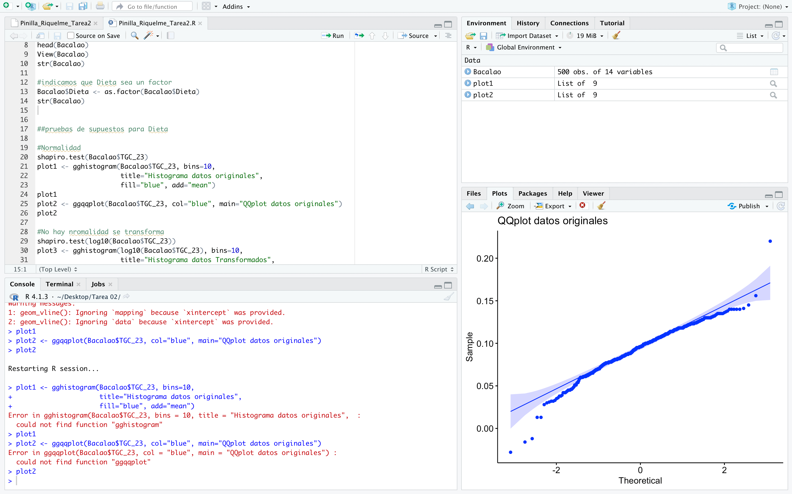
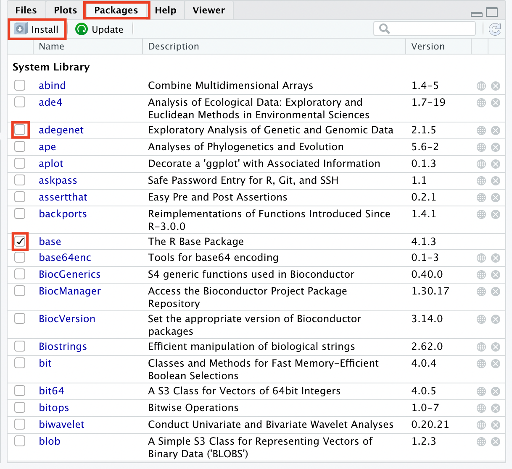
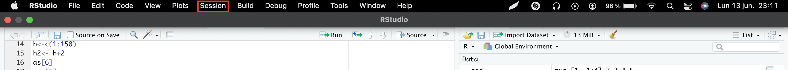
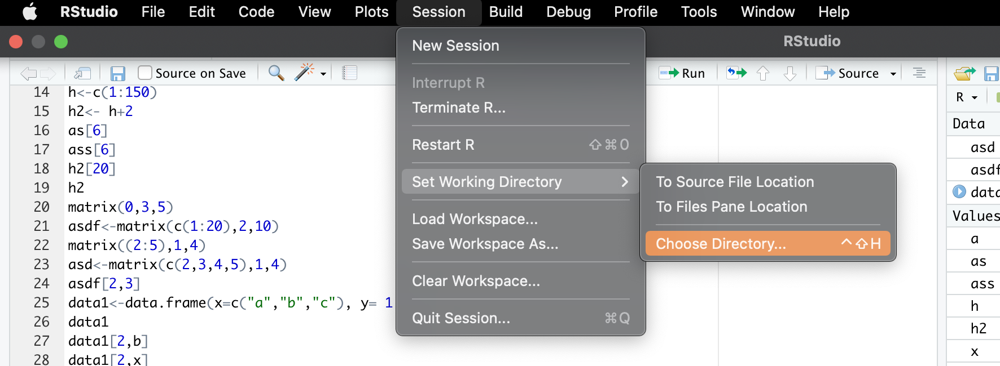

# Introducción a R con un enfoque bioinformático


              

`R` es un lenguaje de programación y un ambiente de cómputo altamente utilizado en bioestadística y bioinformática, el cual posee ciertas características que lo vuelven sumamente accesible y compatible con el trabajo y la reproducibilidad de la información planteada en él.

Algunas de estas cualidades son
- Es de libre acceso 
- Compatible con todas las plataformas
- Se puede utilizar desde el terminal
- Posee su propio software `RStudio`, el que permite trabajar directo sin tener que usar la terminal
- Posee la gran ventaja que con `R` trae una base de información básica, pero posee una basta comunidad que desarrolla nuevos paquetes con funciones extras
- Lo anterior es posible gracias a que `R` es un software de código abierto (por lo tanto, cualquiera puede tener acceso a este)

### Desargar R y RStudio

Para poder utilizar `R` se debe descargar ([aquí](https://cran.r-project.org/)), esta descarga contiene los datos y utilidades de `R` básico. Posterior a la descarga de `R` se recomienda descargar `RStudio` ([aquí](https://www.rstudio.com/products/rstudio/download/)), él cual es un ambiente de desarrollo integrado de `R` que posee un editor de texto, consola y herramientas para administrar el espacio de trabajo.

> Tip: Para activar `R` en la terminal es necesario usar el comando `$Rscript` y podemos distinguir que ya estamos dentro de `R` porque la consola va a mostrar `>`

##### RStudio

En el software se trabaja en un script (al igual que en la terminal) y este script es un archivo de texto plano el cual se puede repetir y es permanente y se almacena como un archivo `.R` y este editor de texto te permite poder escribir los comandos a utilizar, además este software posee diferentes zonas en las que puedes observar tanto el ambiente (donde se guardan tus frames y diferentes variables), historial, la zona de ayuda y la revisión de los diferentes plots



> Tip: uno de los shortcuts útiles en RStudio: 
> - `command/ctrl + enter` para poder enviar el código a la consola
> - `ctrl + 2` para mover el cursor a la consola

### Rmarkdown

Es un formato que te permite crear documentos o reportes, en los que al mismo tiempo puedes guardar y ejecutar el código, pero para usarlo debes intalar el Rmarkdown

````{r}
install.packages("rmarkdown")
````
Con esto podrás crear un archivo `.Rmd`, en el cual tiene 3 tipos de contenidos:
- ``(---)`` encabezado
- ``(```)`` código
- `(Markdown)` texto simple

Las líneas de código se pueden ejecutar de forma independiente e interactiva y los resultados del código escrito se verá debajo de éste.

Este formato de escritura puede tener diferentes formas de exportación o salida que son: HTML, Documentos Interactivos, Word, PDF, entre [otros](https://rmarkdown.rstudio.com/formats.html)

## Funciones básicas de R

Resumen de algunas expresiones básicas:
- Expresiones matemáticas: `2+3`
- Strings de texto: `"Holaaa casa"`
- Valores Lógicos: 
 ```{r}
> 1<5
[1] TRUE
```
- Crear una variable: `a<-6`
- Funciones: comandos que nos permiten hacer acciones específicas, estos están con el paquete básico de `R` (también se pueden obtener nuevos con paquetes de la comunidad) Ejemplo: `sum()`, `mean()`, `help()`

> ```{r}
> #Crear una variable y súmarlo a otra variable
> x<- log10(50)
> z<- 5
> x+z
> [1] 6.69897
> ```

##### Vectores: 
- Vecto `c(7,8,9,10)`, `c(1:20)`
- Acceso a un elemnto de un vector `[]`

##### Matrices
- Matrices `matrix()`
```{r}
> asd<-matrix(c(2,3,4,5),1,4)
     [,1] [,2] [,3] [,4]
[1,]    2    3    4    5
> asdf<-matrix(c(1:20),2,10)
     [,1] [,2] [,3] [,4] [,5] [,6] [,7] [,8] [,9] [,10]
[1,]    1    3    5    7    9   11   13   15   17    19
[2,]    2    4    6    8   10   12   14   16   18    20
```
- Acceso a elementos de una matriz `[ , ]`
```{r}
> asdf[2,3]
[1] 6
```
##### Data frames
- Data frame `data.frame(x,y)`
```{r}
> data1<-data.frame(x=c("a","b","c"), y= 1:3)
> data1
  x y
1 a 1
2 b 2
3 c 3
```
- Acceso a elemento de un data frame `[ , ]`, `$`
```{r}
> data1[2,x]
[1] "b"
> data1$x
[1] "a" "b" "c"
```
## Trabajar con paquetes externos

`R` por sí solo posee funciones más básicas, pero el verdadero valor agregado es utilización de paquetes creados por la comunidad, los cuales son de gran ayuda para realizar análisis de forma más práctica, sencilla o simplemente para poder desarrollar gráficos más bonitos. Estos paquetes se pueden encontrar en [CRAN](https://cran.r-project.org/) o se pueden obtener paquetes de utilidad al buscarlos en Google

Para poder utilizar los paquetes dentro de `R` se deben instalar, para lo cual usamos `install.packages("nombre_del_paquete")`, éste paso puede demorar un poco ya que requiere instalar el paquete y para poder utilizar los paquetes debemos activarlos o llamarlos `library(nombre_del_paquete)`.

Todo esto tambien se puede hacer directamente desde la consola en la siguiente parte



Donde como se marca podemos instalar los paquetes buscando directamente desde CRAN, y luego de esto tendremos que seleccionar en el recuadro para que el paquete que queramos se active y podamos utilizar sus comandos

> Tip: 
> - Cuando comienzas a armar tu script es bueno dejar instalados y activados los paquetes que vayas a utilizar desde el comienzo
> - Un comando que es de gran utilidad cuando se está estudiando un paquete es `?nombre_del_paquete o comando`, con este comando eres dirigido a `help` donde te mostrara el manual del paquete o del comando
> - Es bueno revisar los paquetes ya que hay algunos paquetes que poseen comandos iguales que pueden generar funciones diferentes y esto te puede salir como warning

#### Cargar archivos

El comando `read.algo` es el encargado de permitirte cargar archivos en `R`, los archivos que puede leer `R` son muchos y hay paquetes ademas que te permiten leer diferentes tipos de archivos si es que R básico no lo posee, tenemos como ejemplo el `read.delim` que te permite cargar archivos de texto con filas y columnas o el `read.plink` del paquete snpMatrix

##### Working directory

Para cargar archivos y guardar tus scripts lo altamente recomendable es guardar o settear la sesión, esto te permite poder seleccionar una carpeta de trabajo donde almacenar todo, lo que te genera un lugar de trabajo más cómodo y organizado

Esto se puede realizar con el comando `setwd()` que podremos dar la dirección de donde queremos que nuestra sesión este seteada y para poder saber a donde tenemos que llegar podemos usar `getwd()` para saber dónde estamos. Otra forma de hacerlo es de manera manual 






## For loops 

Al igual que en `bash` se pueden utilizar los for loops con la siguiente escritura `for (variable in vector) {commands}`

lo que se veria asi
```{r}
> h3<- c(3:10)
> for (d in h3) { print(paste(d, "ratones comían comida"))}
[1] "3 ratones comían comida"
[1] "4 ratones comían comida"
[1] "5 ratones comían comida"
[1] "6 ratones comían comida"
[1] "7 ratones comían comida"
[1] "8 ratones comían comida"
[1] "9 ratones comían comida"
[1] "10 ratones comían comida"
```
Para más opciones para los for loop revisar este [tutorial](https://www.datacamp.com/tutorial/tutorial-on-loops-in-r)

## Funciones Propias

Las cuales poseen el siguiente esqueleto de escritura:

```{r}
myfunction <- function(arg1, arg2, ... ){
statements
return(object)
}
```
> Tip: El comando `return` es sumamente necesario ya que nos permite visualizar el resultado de lo que queremos que la función haga

Como alternativa al `return` puedes asignar el nombre del objeto, como cuando uno lo solicita en la terminar 

Si quieres observar resultado y que este no se guarde, utiliza `print()`, este se agrega en la zona debajo de la función

```{r}
give_i_line<- function(file, i){
  ## Arguments
  # file = path to desired file with the indicadores, must be tab delimited and do NOT have a header
  # i = number of line of file we want to print

  ## Function
  # read indicadores list
  indicador<-read.delim(file, header=FALSE, quote="", stringsAsFactors=FALSE)

  print(i)

  # give text of the i line of the file  
  x<-indicador[i,1]
  x
}

give_i_line("../data/indicadores.txt", i=2)
x<-give_i_line("../data/indicadores.txt", i=2)

```

La función también la podemos guardar como un ***Script***, lo cual nos permitirá llamarla desde otro script utilizando `source()`

Además estas funciones seran almacenadas en el "Enviroment" del `R` 
