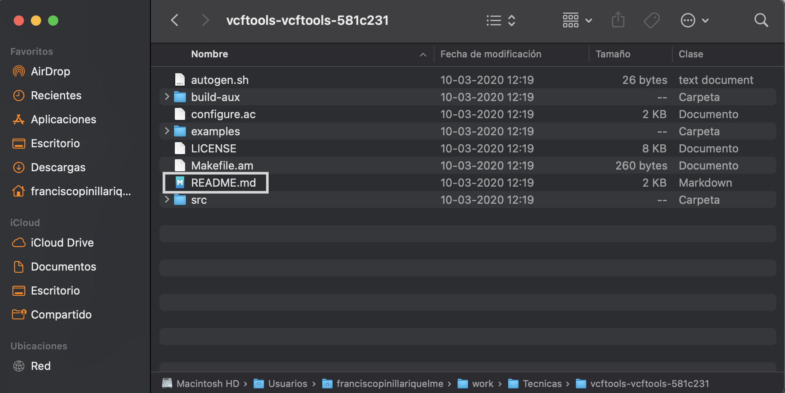
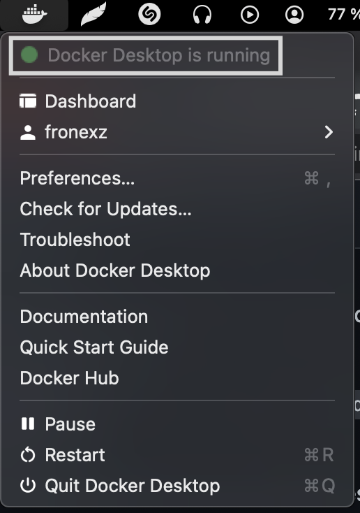

# Introducción al software especializado 

Los software especializados que permiten realizar operaciones complejas con datos genéticos, por ejemplo VFCtools se define como:

"vcftools es un conjunto de funciones para usar en datos de variación genética en forma de archivos VCF y BCF. Las herramientas proporcionadas se utilizarán principalmente para resumir datos, ejecutar cálculos sobre datos, filtrar datos y convertir datos a otros formatos de archivo útiles."

Para más información revisar se aconseja revisar los diferentes software en los siguientes links: [VCFtools](https://vcftools.github.io/index.html), [Stacks](http://catchenlab.life.illinois.edu/stacks/manual/), [Mothur](https://mothur.org/wiki/) o [Trinity](https://github.com/trinityrnaseq/trinityrnaseq/wiki/Running%20Trinity).

## Documentación de software especializado

Estos software poseen documentación especializada, la cual comprende del manual y diferentes tutoriales para los diferentes programas, cabe destacar que los manuales están presentes para todos los software no así los tutoriales que pueden o no tener estos software.

En el caso de los manuales estos se pueden obtener directamente desde el terminal `(>_)` con el comando `$ man (nombre_del_software)` o directamente desde la web. Estos manuales son iguales a los manuales de los diferentes paquetes tanto de `bash` como de `R`, en el cual nos presentan una descripción del software, los usos de sus comandos y unos ejemplos breves.

***Terminal***


***Web***


### Instalación 

los diferentes softwares se instalan mediante líneas de comando de manera directa en un terminal (estos software están preferentemente para sistemas Linux y MacOS), además estos software están escritos en diferentes lenguajes como C++, phyton, entre otros. Debido a esto la instalación de estos programas no se hace con solo dar clic, si no que posee una serie de pasos para instalarse.

#### Pasos:

1) Buscar la versión más actualizada del software, estos por lo general están en su propia página o en un GitHub como este con las instrucciones y datos ya mencionados anteriormente

En este caso nos vamos a centrar en [VCFtools](http://vcftools.github.io/index.html) que fue el que instale.

2) En la página nos centraremos en buscar la seccion que diga ***Download*** (en algunos puede aparecer como ***Install***), esto te llevara a descargar un archivo `.tar` o un comando para poder bajar el programa desde GitHub

      

3) Bajamos el codígo.

Al bajarlo podremos visualizar los contenidos del archivo `.tar` podremos visualizar diferentes archivos:



4) En el archivo `.tar` como se muestra vemos que contiene un archivo de texto llamado ***README*** (este archivo también podría ser un Markdown). Este es el primer archivo que se debe revisar ya que en el vienen las instrucciones de instalación y los pasos a seguir


5) La instalación consiste finalmente en seguir los pasos que nos dice el README


#### Importante

- Lo anterior descrito corre para otros programas pero pueden haber variasiones en los terminos como README por INSTALL
- La instalación y los pasos a seguir pueden diferir entre los programas y a su vez dentro de los diferentes sistemas operativos
- La instalación puede requerir de los siguientes comandos (de hecho estan en las instrucciones del README de VCFtools)
  * `sudo`
  * `./configure`
  * `make`
  * `make install`
> Dato: 
> - Estos comandos son importantes para poder correr el script del programa que queremos instalar y asi posteriormente poder utilizarlo como un programa completo
> - `sudo` es el comando super poderoso que nos permitira realizar o usar un comando con los permisos de super administrador donde nos pedira que autorisemos su uso mediante la clave de usuario
> - Para mas informacion de que hacen los diferenes comandos mencionados revisar el repositorio principal ([BioinfinvRepro](https://github.com/ravuch/BioinfinvRepro)) o bien en el siguiente [link](https://thoughtbot.com/blog/the-magic-behind-configure-make-make-install)

#### Como lo instale

En mi caso la instalación resulto ser no tan simple, debido a que el equipo que ocupo posee `MacOS Monterrey` y al parecer a este le falta algunos comandos, por lo que los tuve que instalar de manera externa.

Por lo que el consejo dado por el [BioinfinvRepro](https://github.com/ravuch/BioinfinvRepro) al comienzo es sumamente importante "siempre buscar en foros".

El problema que se me presento fue un error con el archivo `autogen.sh` el cual decía lo siguiente `$./autogen.sh line 3 autoreconf command not found vcftools`, y la resolución para este problema fue la falta de los siguientes comandos:

- `autoconf`
- `pkg-config`
- `libtools`
- `automake`
- `zlib`

Los cuales para instalarlos necesitaba la instalación de `brew` o `MacPorts` los cuales son administradores de paquetes para el ambiente Mac y permiten la utilización, instalación y actualización de diferentes líneas de comando. En mi caso instale [`MacPorts`](https://www.macports.org/install.php) con el cual pude instalar los comandos necesarios, además poseen una forma más simple de instalación de VCFtools con el siguiente comando por si no se quisiera realizar la instalación manual `$sudo port install vcftools`

> Dato: La página [ports.macports](https://ports.macports.org/) posee un sin fin de programas y comandos para el ambiente Mac, con una forma de instalación más simple mediante comandos `$port`

> Al buscar otros programas software asociados a bioinformática y específicamente genética encontre `Bowtie`, el cual es una ultra rápida herramienta de lectura de alineamientos cortos de DNA, el cual posee una documentación de instalación que se puede observar a simple vista, pero no posee tutorial y si todo resultara de buena manera (cosa difícl que pase, en fin la ley de Murphy) puede ser que se demore lo que necesita el equipo para descargar y procesar los datos que podrían ser unos 15-30 min.

## Problema de las versiones

Al utilizar diferentes versiones de un paquete o OS nos puede llevar a que obtengamos resultados distintos, ya sea para datos propios que estamos estudiando y nos movemos de equipo o recrear datos de otros investigadores, por eso siempre revisar el ambiente donde se realizaron los diferentes cálculos (ya sea sistema operativo, su versión y el programa asociado)

## Docker

Una forma de solucionar ambos problemas es la utilización de software contenedores, como Docker. Este tipos de programas permiten dejar un software dentro de un contenedor con todo los archivos, códigos y las herramientas necesarias para que corran.

Este programa es una versión básica de Linux que nos permite correr una **imagen** (el software que cargamos en el contenedor), además posee un archivo **dockerfile** que es un script que instala el software dentro de la imagen que crearemos con todo lo necesario, al igual como si lo instaláremos en el sistema operativo principal.

En resumen el contenedor como su nombre lo dice nos permite mantener o contener software de manera independiente del sistema principal evitando la variación de los datos debido a las actualizaciones y las variaciones que estas conllevan.

#### Instalación

Para instalar Docker se puede hacer directamente como si fuera un programa o desde la terminal y está presente tanto para [Mac](https://docs.docker.com/desktop/mac/install/), [Ubuntu](https://docs.docker.com/engine/install/ubuntu/) y además posee [tutoriales](https://docs.docker.com/get-started/).

Al tener instalado `Docker` hay que probar si está funcionando correctamente, para eso ocupamos `$docker run hello-world`

```{bash}
% docker run hello-world

Hello from Docker!
This message shows that your installation appears to be working correctly.

To generate this message, Docker took the following steps:
 1. The Docker client contacted the Docker daemon.
 2. The Docker daemon pulled the "hello-world" image from the Docker Hub.
    (arm64v8)
 3. The Docker daemon created a new container from that image which runs the
    executable that produces the output you are currently reading.
 4. The Docker daemon streamed that output to the Docker client, which sent it
    to your terminal.

To try something more ambitious, you can run an Ubuntu container with:
 $ docker run -it ubuntu bash

Share images, automate workflows, and more with a free Docker ID:
 https://hub.docker.com/

For more examples and ideas, visit:
 https://docs.docker.com/get-started/
```

Para iniciar `Docker` lo debemos prender, que es símil a iniciar un programa. Pero puede ser que `Docker` ya este encendido por lo que para comprobarlo hay que correr `$docker ps` y si esta encendida deberíamos obtener lo siguiente:

```{bash}
docker ps
CONTAINER ID   IMAGE     COMMAND   CREATED   STATUS    PORTS     NAMES
```
En Mac también se puede observar en la barra de tareas superior 



### Funcionamiento básico de Docker

La forma de poder utilizar los comandos necesitan el siguiente modo de escritura `$ docker (comando)`. Por ejemplo al usar `$ docker --help`

```{bash}
% docker --help

Usage:  docker [OPTIONS] COMMAND

A self-sufficient runtime for containers

Options:
      --config string      Location of client config files (default "/Users/franciscopinillariquelme/.docker")
  -c, --context string     Name of the context to use to connect to the daemon (overrides DOCKER_HOST env var and default context set with "docker context use")
  -D, --debug              Enable debug mode
  -H, --host list          Daemon socket(s) to connect to
  -l, --log-level string   Set the logging level ("debug"|"info"|"warn"|"error"|"fatal") (default "info")
      --tls                Use TLS; implied by --tlsverify
      --tlscacert string   Trust certs signed only by this CA (default "/Users/franciscopinillariquelme/.docker/ca.pem")
      --tlscert string     Path to TLS certificate file (default "/Users/franciscopinillariquelme/.docker/cert.pem")
      --tlskey string      Path to TLS key file (default "/Users/franciscopinillariquelme/.docker/key.pem")
      --tlsverify          Use TLS and verify the remote
  -v, --version            Print version information and quit

Management Commands:
  builder     Manage builds
  buildx*     Docker Buildx (Docker Inc., v0.8.2)
  compose*    Docker Compose (Docker Inc., v2.6.0)
  config      Manage Docker configs
  container   Manage containers
  context     Manage contexts
  image       Manage images
```

Los comandos con más importancia de `Dcoker` son:

- `pull` bajar una imagen, pero solo una vez

```{bash}
% docker pull ubuntu:14.04
14.04: Pulling from library/ubuntu
d1a5a1e51f25: Pull complete 
e5fc464c2dc9: Pull complete 
561f253b7549: Pull complete 
Digest: sha256:96a36dd3bcd8f149fa9874c4e28c35c01f715b3e5f8f1a8e06b45887619bf43b
Status: Downloaded newer image for ubuntu:14.04
docker.io/library/ubuntu:14.04
```
- `images` con este podremos revisar lo hayamos bajado y comprobar que lo que bajamos fue lo deseado

```{bash}
% docker images
REPOSITORY    TAG       IMAGE ID       CREATED        SIZE
alpine/git    latest    19177234a769   3 weeks ago    38MB
hello-world   latest    46331d942d63   2 months ago   9.14kB
ubuntu        14.04     7304c635fe52   8 months ago   187MB
```

- `run` nos permite cargar la imagen dentro de un contenedor

```{bash}
% docker run -it ubuntu bash
root@0631f8e189a5:/# ls
bin  boot  dev  etc  home  lib  media  mnt  opt  proc  root  run  sbin  srv  sys  tmp  usr  var
root@0631f8e189a5:/# mkdir Prueba
root@0631f8e189a5:/# ls
Prueba  bin  boot  dev  etc  home  lib  media  mnt  opt  proc  root  run  sbin  srv  sys  tmp  usr  var
root@0631f8e189a5:/# mkdir Hola
root@0631f8e189a5:/# ls
Hola  Prueba  bin  boot  dev  etc  home  lib  media  mnt  opt  proc  root  run  sbin  srv  sys  tmp  usr  var
root@0631f8e189a5:/# 
```
> Tip: en este caso tenemos que el cambio del signo para anotar los comandos se presenta como `#` el cual nos dice que tenemos permiso de administrador a diferencia del `$` que es de usuario

> Dato: 
> - Esta versión de Ubuntu no es la más actual así que para actualizarla se puede correr `# apt-get update`
> - Ahora que tenemos actualizado podremos instalar diferentes herramientas con el comando `# apt-get install (nombre_de_la_herramienta)` 

- `exit` nos sirve para poder salir de la imagen en la que estamos trabajando y volver al `Docker` 

- `ps -a` nos va a permitir ver los contenedores que poseemos

```{bash}
% docker ps -a
CONTAINER ID   IMAGE         COMMAND                  CREATED          STATUS                      PORTS     NAMES
0631f8e189a5   ubuntu        "bash"                   12 minutes ago   Exited (0) 30 seconds ago             keen_rhodes
7ab1e9f06b69   ubuntu        "bash"                   13 minutes ago   Exited (0) 13 minutes ago             suspicious_wiles
c4781ba40b9a   hello-world   "/hello"                 2 hours ago      Exited (0) 2 hours ago                condescending_pascal
7eff9d3f66fb   hello-world   "/hello"                 14 hours ago     Exited (0) 14 hours ago               eager_jones
38450583b4db   alpine/git    "git clone https://g…"   15 hours ago     Exited (0) 15 hours ago               repo
```
- `start` nos permitirá dar la partida a nuestro contenedor, el cual se realiza con el ID del contenedor

```{bash}
% docker start 0631f8e189a5
0631f8e189a5
```
> Tip: usar `$ docker ps` nos permite ver los contenedores activos

- `exec` podremos volver a entrar a nuestro contenedor

```{bash}
% docker exec -it 0631f8e189a5 bash
root@0631f8e189a5:/# 
```

> Dato: si ocupamos `# ls` podremos ver que los cambios hechos se mantienen aun dentro del contenedor

- `stop` nos sirve para cuando salgamos del contenedor poder detenerlo

```{bash}
root@0631f8e189a5:/# exit
exit
% docker stop 0631f8e189a5
0631f8e189a5
```

> Tip: 
> - Si ocupamos `$ docker ps` veremos que no hay ningún contenedor activo
> - Además si queremos que nuestro contenedor corra en segundo plano desde que iniciamos podemos usar `$ docker run -dit (nombre del contenedor) (comando)` en este caso el flag `-d` nos permite esta acción

#### Borrar contenedores e imágenes

Para poder hacer algunas de estas 2 acciones se debe primero detener el contenedor (`$ docker stop CONTAINED-ID`) y luego borrar: Contenedor `$ docker rm CONATINED-ID` e imagen `$ docker rmi -f IMAGE-ID`

#### Conectar un contenedor con un directorio en el OS nativo ("montar un volumen")

Como primer paso debemos asegurarnos que tenemos una imagen de Ubuntu

```{bash}
docker images
REPOSITORY    TAG       IMAGE ID       CREATED        SIZE
ubuntu        latest    a7870fd478f4   9 days ago     69.2MB
alpine/git    latest    19177234a769   3 weeks ago    38MB
hello-world   latest    46331d942d63   2 months ago   9.14kB
ubuntu        14.04     7304c635fe52   8 months ago   187MB
```
Luego hay que correr la imagen dentro de un contenedor, pero este contenedor va a estar montado en un directorio, lo cual es **Montar un volumen**, lo que permitirá que pueda entrar a los datos del directorio

```{bash}
% docker run -v /Users/franciscopinillariquelme/work/Tecnicas/BioinfinvRepro-master/Unidad4/Prac_Uni4/DatosContenedor1:/DatosContenedorEjerciciosClase -it ubuntu bash
root@7dc39ca4b71d:/# 
```
> Tip: 
> - `-v` nos indica la formación de un volumen
> - `:/` nos indica como queremos que se llame nuestro directorio dentro del contenedor

Ahora podremos explorar los datos que se encuentran en el archivo que tenemos en el OS nativo directo desde nuestro contenedor

```{bash}
root@7dc39ca4b71d:/# cd DatosContenedorEjerciciosClase
root@7dc39ca4b71d:/DatosContenedorEjerciciosClase# ls
datos
root@7dc39ca4b71d:/DatosContenedorEjerciciosClase# cd datos
root@7dc39ca4b71d:/DatosContenedorEjerciciosClase/datos# ls
clean_human_data.fastq  human_Illumina_dataset.fastq
root@7dc39ca4b71d:/DatosContenedorEjerciciosClase/datos# touch prueba
root@7dc39ca4b71d:/DatosContenedorEjerciciosClase/datos# ls
clean_human_data.fastq  human_Illumina_dataset.fastq  prueba
root@7dc39ca4b71d:/DatosContenedorEjerciciosClase/datos# 
```

Ahora vamos a dejar correr el contenedor que creamos en el montamos nuestro volumen, para eso debemos:

```{bash}
% docker ps -a
CONTAINER ID   IMAGE         COMMAND                  CREATED          STATUS                        PORTS     NAMES
7dc39ca4b71d   ubuntu        "bash"                   8 minutes ago    Exited (0) 16 seconds ago               romantic_galileo
0631f8e189a5   ubuntu        "bash"                   53 minutes ago   Exited (137) 28 minutes ago             keen_rhodes
7ab1e9f06b69   ubuntu        "bash"                   54 minutes ago   Exited (0) 54 minutes ago               suspicious_wiles
c4781ba40b9a   hello-world   "/hello"                 3 hours ago      Exited (0) 3 hours ago                  condescending_pascal
7eff9d3f66fb   hello-world   "/hello"                 15 hours ago     Exited (0) 15 hours ago                 eager_jones
38450583b4db   alpine/git    "git clone https://g…"   16 hours ago     Exited (0) 16 hours ago                 repo
% docker start 7dc39ca4b71d 
7dc39ca4b71d
% docker ps
CONTAINER ID   IMAGE     COMMAND   CREATED          STATUS          PORTS     NAMES
7dc39ca4b71d   ubuntu    "bash"    12 minutes ago   Up 19 seconds             romantic_galileo
% docker exec -it 7dc39ca4b71d /bin/bash 
root@7dc39ca4b71d:/# 
```

Procedemos a actualizar el software de ubuntu de base y bajar algunos esenciales que no vienen en nuestra imagen de ubuntu básica

```{bash}
root@7dc39ca4b71d:/# apt-get update
Get:1 http://ports.ubuntu.com/ubuntu-ports jammy InRelease [270 kB]
Get:2 http://ports.ubuntu.com/ubuntu-ports jammy-updates InRelease [109 kB]
Get:3 http://ports.ubuntu.com/ubuntu-ports jammy-backports InRelease [99.8 kB]
Get:4 http://ports.ubuntu.com/ubuntu-ports jammy-security InRelease [110 kB]
Get:5 http://ports.ubuntu.com/ubuntu-ports jammy/multiverse arm64 Packages [224 kB]
Get:6 http://ports.ubuntu.com/ubuntu-ports jammy/main arm64 Packages [1758 kB]
Get:7 http://ports.ubuntu.com/ubuntu-ports jammy/restricted arm64 Packages [24.2 kB]
```

```{bash}
root@7dc39ca4b71d:/# apt-get install build-essential
Reading package lists... Done
Building dependency tree... Done
```
> Dato: la instalación de `build-essential` nos va a instalar muchos archivos y nos va a preguntar si deseamos seguir descargando ya que estos archivos ocuparan espacio en el disco por lo que debemos decir `Y`

Ahora pasaremos a poner a prueba estos comandos para eso descargaremos el archivo `fastx_toolkit-0.0.14.tar.bz2` desde [FastX-Tools](http://hannonlab.cshl.edu/fastx_toolkit/download.html), el cual debemos dejar en la carpeta `DatosContenedor1` sin descomprimir

El cual podremos visualizar desde nuesto contenedor

```{bash}
root@7dc39ca4b71d:/# ls
DatosContenedorEjerciciosClase  bin  boot  dev  etc  home  lib  media  mnt  opt  proc  root  run  sbin  srv  sys  tmp  usr  var
root@7dc39ca4b71d:/# cd DatosContenedorEjerciciosClase
root@7dc39ca4b71d:/DatosContenedorEjerciciosClase# ls
datos  fastx_toolkit-0.0.14.tar.bz2
```

Procedemos a descomprimir el archivo con el comando `tar -xvf` (`x` extrae los archivos, `v` nos muestra el proceso y `f` el nombre del archivo). El archivo después de descomprimirse debería verse así

```{bash}
root@7dc39ca4b71d:/DatosContenedorEjerciciosClase# ls
datos  fastx_toolkit-0.0.14  fastx_toolkit-0.0.14.tar.bz2
root@7dc39ca4b71d:/DatosContenedorEjerciciosClase# cd fastx_toolkit-0.0.14
root@7dc39ca4b71d:/DatosContenedorEjerciciosClase/fastx_toolkit-0.0.14# ls
AUTHORS  ChangeLog  Makefile.am  NEWS    THANKS      build_scripts  config.h.in  configure.ac  galaxy                   m4      scripts
COPYING  INSTALL    Makefile.in  README  aclocal.m4  config         configure    doc           install_galaxy_files.sh  reconf  src
```

## Biocontainers

Para formar los contenedores de docker, estos se forman a partir de una imagen. Esta imagen puede ser un OS básico o también puede incluir un software o un conjunto de ellos ya instalados y listos para usarlos, además de los comandos que necesitamos.

Todo esto se hace atraves de un dockerfile el cual es un script que instala y describe al software que pondremos dentro de la imagen, además posee datos de la configuración e instalación, incluyendo los comandos.

Biocontainers es una comunidad que crea imagenes para instalar software la cual puedes revisar [aquí](https://biocontainers.pro/)

### Tip: 
- Borrar automáticamente un contenedor cuando se termina de correr, ya que stos ocupan espacios en el disco. Además cada vez que se hace `docker run` para una imagen se genera un contenedor. 
- En el caso de ocupar las imagenes de Biocontainers, para eso puedes usar en el comando `run` el flag `-- rm` para que asi al salir del conetenedor este automaticamente se elimine.
- Ademas puedes agregar comandos para que activen la accion de cerrar y eliminar el contenedor `-c exit`.

```{bash}
% docker run --rm biocontainers/fastxtools:0.0.14 fastq_to_fasta -h -c exit
WARNING: The requested image's platform (linux/amd64) does not match the detected host platform (linux/arm64/v8) and no specific platform was requested
usage: fastq_to_fasta [-h] [-r] [-n] [-v] [-z] [-i INFILE] [-o OUTFILE]
Part of FASTX Toolkit 0.0.14 by A. Gordon (assafgordon@gmail.com)

   [-h]         = This helpful help screen.
   [-r]         = Rename sequence identifiers to numbers.
   [-n]         = keep sequences with unknown (N) nucleotides.
                  Default is to discard such sequences.
   [-v]         = Verbose - report number of sequences.
                  If [-o] is specified,  report will be printed to STDOUT.
                  If [-o] is not specified (and output goes to STDOUT),
                  report will be printed to STDERR.
   [-z]         = Compress output with GZIP.
   [-i INFILE]  = FASTA/Q input file. default is STDIN.
   [-o OUTFILE] = FASTA output file. default is STDOUT.

franciscopinillariquelme@MacBook-Air-de-Francisco ~ % docker ps -a
CONTAINER ID   IMAGE         COMMAND                  CREATED             STATUS                     PORTS     NAMES
7dc39ca4b71d   ubuntu        "bash"                   About an hour ago   Up About an hour                     romantic_galileo
0631f8e189a5   ubuntu        "bash"                   2 hours ago         Exited (137) 2 hours ago             keen_rhodes
7ab1e9f06b69   ubuntu        "bash"                   2 hours ago         Exited (0) 2 hours ago               suspicious_wiles
c4781ba40b9a   hello-world   "/hello"                 4 hours ago         Exited (0) 4 hours ago               condescending_pascal
7eff9d3f66fb   hello-world   "/hello"                 16 hours ago        Exited (0) 16 hours ago              eager_jones
38450583b4db   alpine/git    "git clone https://g…"   17 hours ago        Exited (0) 17 hours ago              repo
```
Vemos que el contenedor `biocontainers/fastxtools:0.0.14 fastq_to_fasta` no aparece

```{bash}
 % docker run --rm biocontainers/fastxtools:0.0.14 bash -c "fastq_to_fasta -h ; echo hola mundo"
WARNING: The requested image's platform (linux/amd64) does not match the detected host platform (linux/arm64/v8) and no specific platform was requested
usage: fastq_to_fasta [-h] [-r] [-n] [-v] [-z] [-i INFILE] [-o OUTFILE]
Part of FASTX Toolkit 0.0.14 by A. Gordon (assafgordon@gmail.com)

   [-h]         = This helpful help screen.
   [-r]         = Rename sequence identifiers to numbers.
   [-n]         = keep sequences with unknown (N) nucleotides.
                  Default is to discard such sequences.
   [-v]         = Verbose - report number of sequences.
                  If [-o] is specified,  report will be printed to STDOUT.
                  If [-o] is not specified (and output goes to STDOUT),
                  report will be printed to STDERR.
   [-z]         = Compress output with GZIP.
   [-i INFILE]  = FASTA/Q input file. default is STDIN.
   [-o OUTFILE] = FASTA output file. default is STDOUT.

hola mundo
% docker ps -a
CONTAINER ID   IMAGE         COMMAND                  CREATED             STATUS                     PORTS     NAMES
7dc39ca4b71d   ubuntu        "bash"                   About an hour ago   Up About an hour                     romantic_galileo
0631f8e189a5   ubuntu        "bash"                   2 hours ago         Exited (137) 2 hours ago             keen_rhodes
```
En este caso vemos que corre el comando `hola mundo`, nos cierra el contendor y lo elimina

> Dato: 
> - El flag `-c` nos sirve para que corra más de un comando dentro del mismo contenedor y que solo estan unidos por `|`, `;`, entre otros.
> - Sí se corre con `bash` más los comandos deseados entre " el sistema se saldrá automáticamente sin necesidad de decir `exit` al terminar de correr todos los comandos.
