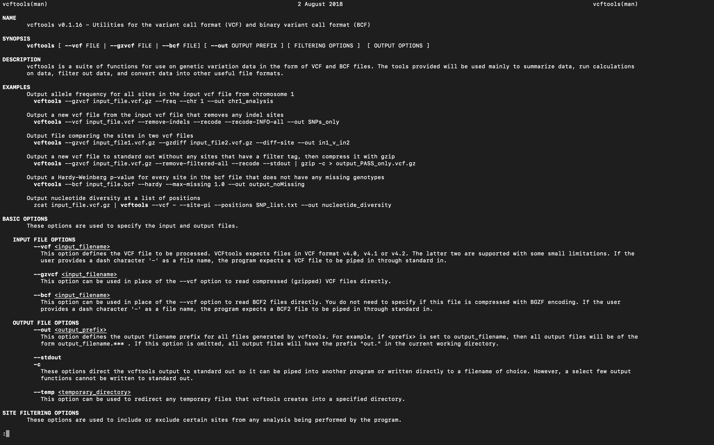
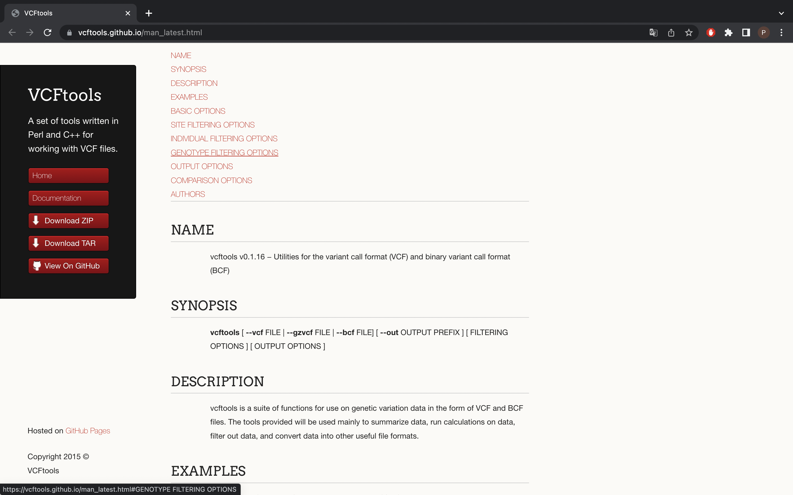
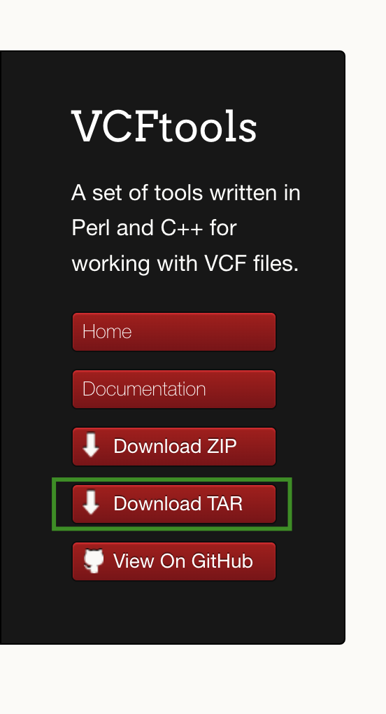

# Introducción al software especializado 

Los software especializados que permiten realizar operaciones complejas con datos genéticos, por ejemplo VFCtools se define como:

"vcftools es un conjunto de funciones para usar en datos de variación genética en forma de archivos VCF y BCF. Las herramientas proporcionadas se utilizarán principalmente para resumir datos, ejecutar cálculos sobre datos, filtrar datos y convertir datos a otros formatos de archivo útiles."

Para más información revisar se aconseja revisar los diferentes software en los siguientes links: [VCFtools](https://vcftools.github.io/index.html), [Stacks](http://catchenlab.life.illinois.edu/stacks/manual/), [Mothur](https://mothur.org/wiki/) o [Trinity](https://github.com/trinityrnaseq/trinityrnaseq/wiki/Running%20Trinity).

## Documentación de software especializado

Estos software poseen documentación especializada, la cual comprende del manual y diferentes tutoriales para los diferentes programas, cabe destacar que los manuales están presentes para todos los software no así los tutoriales que pueden o no tener estos software.

En el caso de los manuales estos se pueden obtener directamente desde el terminal `(>_)` con el comando `$ man (nombre_del_software)` o directamente desde la web. Estos manuales son iguales a los manuales de los diferentes paquetes tanto de `bash` como de `R`, en el cual nos presentan una descripción del software, los usos de sus comandos y unos ejemplos breves.

***Terminal***

***Web***

#### Instalación 

los diferentes softwares se instalan mediante líneas de comando de manera directa en un terminal (estos software están preferentemente para sistemas Linux y MacOS), además estos software están escritos en diferentes lenguajes como C++, phyton, entre otros. Debido a esto la instalación de estos programas no se hace con solo dar clic, si no que posee una serie de pasos para instalarse.

###### Pasos:

1) Buscar la versión más actualizada del software, estos por lo general están en su propia página o en un GitHub como este con las instrucciones y datos ya mencionados anteriormente

En este caso nos vamos a centrar en [VCFtools](http://vcftools.github.io/index.html) que fue el que instale.

2) En la página nos centraremos en buscar la seccion que diga ***Download*** (en algunos puede aparecer como ***Install***), esto te llevara a descargar un archivo `.tar` o un comando para poder bajar el programa desde GitHub

3) Bajamos el codígo.

Al bajarlo podremos visualizar los contenidos del archivo `.tar` podremos visualizar diferentes archivos:

