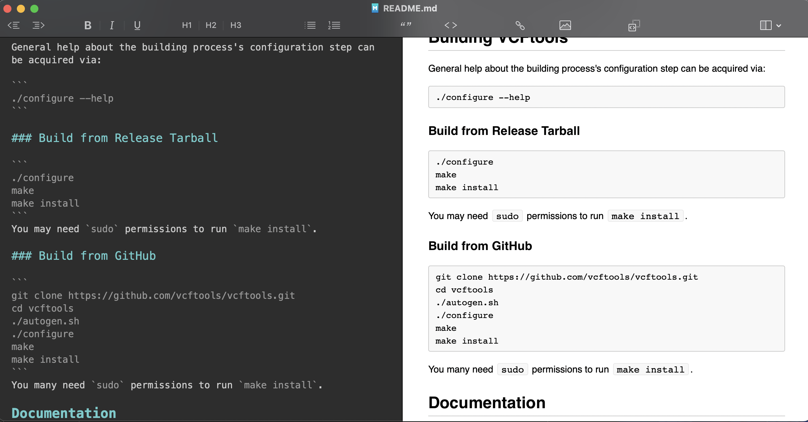

# Introducción al software especializado 

Los software especializados que permiten realizar operaciones complejas con datos genéticos, por ejemplo VFCtools se define como:

"vcftools es un conjunto de funciones para usar en datos de variación genética en forma de archivos VCF y BCF. Las herramientas proporcionadas se utilizarán principalmente para resumir datos, ejecutar cálculos sobre datos, filtrar datos y convertir datos a otros formatos de archivo útiles."

Para más información revisar se aconseja revisar los diferentes software en los siguientes links: [VCFtools](https://vcftools.github.io/index.html), [Stacks](http://catchenlab.life.illinois.edu/stacks/manual/), [Mothur](https://mothur.org/wiki/) o [Trinity](https://github.com/trinityrnaseq/trinityrnaseq/wiki/Running%20Trinity).

## Documentación de software especializado

Estos software poseen documentación especializada, la cual comprende del manual y diferentes tutoriales para los diferentes programas, cabe destacar que los manuales están presentes para todos los software no así los tutoriales que pueden o no tener estos software.

En el caso de los manuales estos se pueden obtener directamente desde el terminal `(>_)` con el comando `$ man (nombre_del_software)` o directamente desde la web. Estos manuales son iguales a los manuales de los diferentes paquetes tanto de `bash` como de `R`, en el cual nos presentan una descripción del software, los usos de sus comandos y unos ejemplos breves.

***Terminal***


***Web***


### Instalación 

los diferentes softwares se instalan mediante líneas de comando de manera directa en un terminal (estos software están preferentemente para sistemas Linux y MacOS), además estos software están escritos en diferentes lenguajes como C++, phyton, entre otros. Debido a esto la instalación de estos programas no se hace con solo dar clic, si no que posee una serie de pasos para instalarse.

#### Pasos:

1) Buscar la versión más actualizada del software, estos por lo general están en su propia página o en un GitHub como este con las instrucciones y datos ya mencionados anteriormente

En este caso nos vamos a centrar en [VCFtools](http://vcftools.github.io/index.html) que fue el que instale.

2) En la página nos centraremos en buscar la seccion que diga ***Download*** (en algunos puede aparecer como ***Install***), esto te llevara a descargar un archivo `.tar` o un comando para poder bajar el programa desde GitHub

      

3) Bajamos el codígo.

Al bajarlo podremos visualizar los contenidos del archivo `.tar` podremos visualizar diferentes archivos:


4) En el archivo `.tar` como se muestra vemos que contiene un archivo de texto llamado ***README*** (este archivo también podría ser un Markdown). Este es el primer archivo que se debe revisar ya que en el vienen las instrucciones de instalación y los pasos a seguir



5) La instalación consiste finalmente en seguir los pasos que nos dice el README


#### Importante

- Lo anterior descrito corre para otros programas pero pueden haber variasiones en los terminos como README por INSTALL
- La instalación y los pasos a seguir pueden diferir entre los programas y a su vez dentro de los diferentes sistemas operativos
- La instalación puede requerir de los siguientes comandos (de hecho estan en las instrucciones del README de VCFtools)
  * `sudo`
  * `./configure`
  * `make`
  * `make install`
> Dato: 
> - Estos comandos son importantes para poder correr el script del programa que queremos instalar y asi posteriormente poder utilizarlo como un programa completo
> - `sudo` es el comando super poderoso que nos permitira realizar o usar un comando con los permisos de super administrador donde nos pedira que autorisemos su uso mediante la clave de usuario
> - Para mas informacion de que hacen los diferenes comandos mencionados revisar el repositorio principal ([BioinfinvRepro](https://github.com/ravuch/BioinfinvRepro)) o bien en el siguiente [link](https://thoughtbot.com/blog/the-magic-behind-configure-make-make-install)

#### Como lo instale

En mi caso la instalación resulto ser no tan simple, debido a que el equipo que ocupo posee `MacOS Monterrey` y al parecer a este le falta algunos comandos por lo que los tuve que instalar de manera externa.

Por lo que el consejo dado por el [BioinfinvRepro](https://github.com/ravuch/BioinfinvRepro) al comienzo es sumamente importante "siempre buscar en foros".

El problema que se me presento fue un error con el archivo `autogen.sh` el cual decía lo siguiente `$./autogen.sh line 3 autoreconf command not found vcftools`, y la resolución para este problema fue la falta de los siguientes comandos:

- `autoconf`
- `pkg-config`
- `libtools`
- `automake`
- `zlib`

Los cuales para instalarlos necesitaba la instalación de `brew` o `MacPorts` los cuales son administradores de paquetes para el ambiente Mac y permiten la utilización, instalación y actualización de diferentes líneas de comando. En mi caso instale [`MacPorts`](https://www.macports.org/install.php) con el cual pude instalar los comandos necesarios, además poseen una forma más simple de instalación de VCFtools con el siguiente comando por si no se quisiera realizar la instalación manual `$sudo port install vcftools`

> Dato: La página [ports.macports](https://ports.macports.org/) posee un sin fin de programas y comandos para el ambiente Mac, con una forma de instalación más simple mediante comandos `$port`

> Al buscar otros programas software asociados a bioinformática y específicamente genética encontre `Bowtie`, el cual es una ultra rápida herramienta de lectura de alineamientos cortos de DNA, el cual posee una documentación de instalación que se puede observar a simple vista, pero no posee tutorial y si todo resultara de buena manera (cosa difícl que pase, en fin la ley de Murphy) puede ser que se demore lo que necesita el equipo para descargar y procesar los datos que podrían ser unos 15-30 min.

## Problema de las versiones

Al utilizar diferentes versiones de un paquete o OS nos puede llevar a que obtengamos resultados distintos, ya sea para datos propios que estamos estudiando y nos movemos de equipo o recrear datos de otros investigadores, por eso siempre revisar el ambiente donde se realizaron los diferentes cálculos (ya sea sistema operativo, su versión y el programa asociado)

## Docker

Una forma de solucionar ambos problemas es la utilización de software contenedores, como Docker. Este tipos de programas permiten dejar un software dentro de un contenedor con todo los archivos, códigos y las herramientas necesarias para que corran.

Este programa es una versión básica de Linux que nos permite correr una **imagen** (el software que cargamos en el contenedor), además posee un archivo **dockerfile** que es un script que instala el software dentro de la imagen que crearemos con todo lo necesario, al igual como si lo instaláremos en el sistema operativo principal.

En resumen el contenedor como su nombre lo dice nos permite mantener o contener software de manera independiente del sistema principal evitando la variación de los datos debido a las actualizaciones y las variaciones que estas conllevan.

#### Instalación

Para instalar Docker se puede hacer directamente como si fuera un programa o desde la terminal y está presente tanto para [Mac](https://docs.docker.com/desktop/mac/install/), [Ubuntu](https://docs.docker.com/engine/install/ubuntu/) y además posee [tutoriales](https://docs.docker.com/get-started/).

Al tener instalado `Docker` hay que probar si está funcionando correctamente, para eso ocupamos `$docker run hello-world`

```{bash}
% docker run hello-world

Hello from Docker!
This message shows that your installation appears to be working correctly.

To generate this message, Docker took the following steps:
 1. The Docker client contacted the Docker daemon.
 2. The Docker daemon pulled the "hello-world" image from the Docker Hub.
    (arm64v8)
 3. The Docker daemon created a new container from that image which runs the
    executable that produces the output you are currently reading.
 4. The Docker daemon streamed that output to the Docker client, which sent it
    to your terminal.

To try something more ambitious, you can run an Ubuntu container with:
 $ docker run -it ubuntu bash

Share images, automate workflows, and more with a free Docker ID:
 https://hub.docker.com/

For more examples and ideas, visit:
 https://docs.docker.com/get-started/
```

Para iniciar `Docker` lo debemos prender, que es símil a iniciar un programa. Pero puede ser que `Docker` ya este encendido por lo que para comprobarlo hay que correr `$docker ps` y si esta encendida deberíamos obtener lo siguiente:

```{bash}
docker ps
CONTAINER ID   IMAGE     COMMAND   CREATED   STATUS    PORTS     NAMES
```
En Mac también se puede observar en la barra de tareas superior 


### Funcionamiento básico de Docker

La forma de poder utilizar los comandos necesitan el siguiente modo de escritura `$ docker (comando)`. Por ejemplo al usar `$ docker --help`

```{bash}
% docker --help

Usage:  docker [OPTIONS] COMMAND

A self-sufficient runtime for containers

Options:
      --config string      Location of client config files (default "/Users/franciscopinillariquelme/.docker")
  -c, --context string     Name of the context to use to connect to the daemon (overrides DOCKER_HOST env var and default context set with "docker context use")
  -D, --debug              Enable debug mode
  -H, --host list          Daemon socket(s) to connect to
  -l, --log-level string   Set the logging level ("debug"|"info"|"warn"|"error"|"fatal") (default "info")
      --tls                Use TLS; implied by --tlsverify
      --tlscacert string   Trust certs signed only by this CA (default "/Users/franciscopinillariquelme/.docker/ca.pem")
      --tlscert string     Path to TLS certificate file (default "/Users/franciscopinillariquelme/.docker/cert.pem")
      --tlskey string      Path to TLS key file (default "/Users/franciscopinillariquelme/.docker/key.pem")
      --tlsverify          Use TLS and verify the remote
  -v, --version            Print version information and quit

Management Commands:
  builder     Manage builds
  buildx*     Docker Buildx (Docker Inc., v0.8.2)
  compose*    Docker Compose (Docker Inc., v2.6.0)
  config      Manage Docker configs
  container   Manage containers
  context     Manage contexts
  image       Manage images
```

Los comandos con más importancia de `Dcoker` son:

- `pull` bajar una imagen, pero solo una vez

```{bash}
% docker pull ubuntu:14.04
14.04: Pulling from library/ubuntu
d1a5a1e51f25: Pull complete 
e5fc464c2dc9: Pull complete 
561f253b7549: Pull complete 
Digest: sha256:96a36dd3bcd8f149fa9874c4e28c35c01f715b3e5f8f1a8e06b45887619bf43b
Status: Downloaded newer image for ubuntu:14.04
docker.io/library/ubuntu:14.04
```
- `images` con este podremos revisar lo hayamos bajado y comprobar que lo que bajamos fue lo deseado

```{bash}
% docker images
REPOSITORY    TAG       IMAGE ID       CREATED        SIZE
alpine/git    latest    19177234a769   3 weeks ago    38MB
hello-world   latest    46331d942d63   2 months ago   9.14kB
ubuntu        14.04     7304c635fe52   8 months ago   187MB
```

- `run`


- `exit`
- `stop`
- `restart`
- `exec`
- `rm`
- `rmi`

